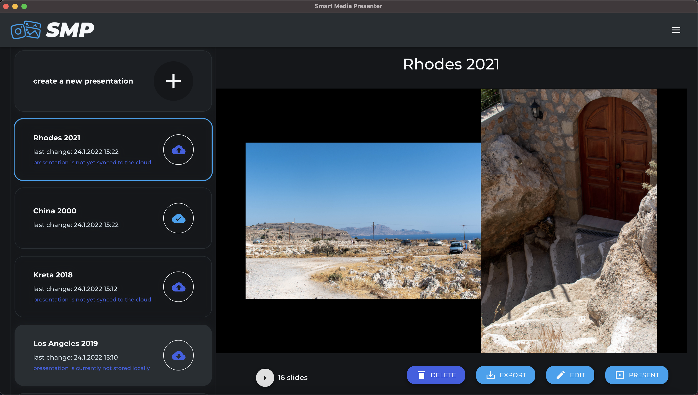

 

  

<h1 align="center" >
    Smart Media Presenter
</h1>
 
 

## Description

The Smart Media Presenter was developed as an open source desktop application in the process of a Bachelor Thesis. It was built using TypeScript, Electron.js, React.js, MaterialUI and Firebase. The application focuses on the creation of slide shows for panoramic photos consiting of multiple images. Presentations can be created, edited, presented and synced to the cloud.

  

## Running the Application

#### Prerequisites

- [node.js](https://nodejs.org/en/download/) has to be installed
- execute following command to install all dependecies from the root directory of the project `npm install`

###### Optional - only required if the cloud integration should be supported:

- create a [firebase project](https://console.firebase.google.com/u/0/)
- fill in the provided .env file with your firebase project's credentials. You will find them in the firebase console, under your project's settings
- you might also have to adjust the rules for firebase realtime database and firebase storage

#### Available Scripts

- `npm run dev` will start the desktop application in dev mode. Make sure port 3000 is not occupied by any other process.
- `npm run dist` will package the application and create an executable for the operating system you are on

## Author

- [@lksjgr](https://www.github.com/lksjgr)

## Supervisor

- [Univ.-Prof. Dipl.-Ing. Dr. Erich Schikuta](mailto:erich.schikuta@univie.ac.at)
