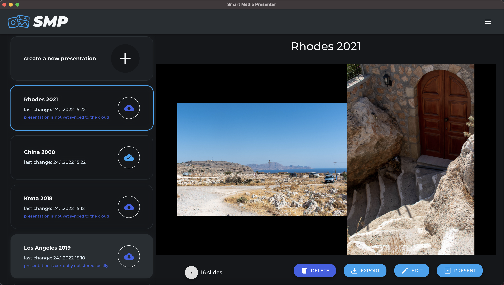

<div align="center">

 &nbsp; 
 &nbsp; 
 &nbsp; 
 &nbsp; 

</div>
<br/>
<p align="center">
  
</p>
<h1 align="center" >
    Smart Media Presenter
</h1>
<br />

## Description

The Smart Media Presenter was developed as an open source desktop application in the process of a Bachelor Thesis. It was built using TypeScript, Electron.js, React.js, MaterialUI and Firebase. The application focuses on the creation of slide shows for panoramic photos consiting of multiple images. Presentations can be created, edited, presented and synced to the cloud.

<p align="center">
  
</p>

## Running the Application

### Installation

- [node.js](https://nodejs.org/en/download/) has to be installed (Tested with v20.10.0)
- execute following command to install all dependecies from the root directory of the project `npm install`

#### Installing the python libraries for image processing tasks

> Some image processing tasks are using python scripts

1) Install python3 & pip
2) `cd` to `assets/python`
3) run `pip install -r ./requirements.txt`

#### Packaging the python libraries

> For distributing the app, the python scripts must be packaged.
> Otherwise, the user of the app must have python3 and all neccessary packages preinstalled on the machine

1) `cd` to `assets/python`
2) run `pyinstaller color_transfer.py --nowindowed`
2) run `pyinstaller image_alignment.py --nowindowed`

#### Optional - only required if the cloud integration should be supported:

> Attention: Firebase integration is currently deactivated

1) create a [firebase project](https://console.firebase.google.com/u/0/)
2) fill in the provided .env file with your firebase project's credentials. You will find them in the firebase console, under your project's settings
3) you might also have to adjust the rules for firebase realtime database and firebase storage

### Running in VSCode Debugging Mode

1) Switch to the "run and debug" context (Ctrl+Shift+D)
2) Choose the launch configuration "Electron:All" on top
3) Launch the debugger (F5)
4) _If the renderer crashes the first time, try restarting the renderer only by selecting the "Electron:Renderer" configuration an running it_

### Running from Command Line in Debugging Mode

- Execute `npm start`. The window should open automatically

###

---

## Installed libraries (on top of `electron-react-boilerplate`)

### Material UI - a popupar React UI framework
- `npm i @mui/material @emotion/react @emotion/styled`
- `npm i @mui/icons-material @mui/system`
- `npm i @mui/styles --force` (This is incompatible with react v18)

### Firebase API
- `npm i firebase@9.6.1` (Version 9 kept for easier upgrading)

### Additional tooling
- `npm i i18next lodash xlsx web-vitals font-list`

### React packages
- `npm i react-color react-edit-text react-full-screen react-i18next react-image-crop react-lazy-load-image-component react-redux`

- `npm install @types/react-edit-text --save-dev`
- `npm install @types/lodash --save-dev`
- `npm install @types/react-lazy-load-image-component --save-dev`

### Python Shell
- `npm install python-shell`

---

## Author

- [@lksjgr](https://www.github.com/lksjgr)

## Supervisor

- [Univ.-Prof. Dipl.-Ing. Dr. Erich Schikuta](mailto:erich.schikuta@univie.ac.at)

---

---
---

<br><br>


<br>

<p>
  Electron React Boilerplate uses <a href="https://electron.atom.io/">Electron</a>, <a href="https://facebook.github.io/react/">React</a>, <a href="https://github.com/reactjs/react-router">React Router</a>, <a href="https://webpack.js.org/">Webpack</a> and <a href="https://www.npmjs.com/package/react-refresh">React Fast Refresh</a>.
</p>

<br>

<div align="center">

[![Build Status][github-actions-status]][github-actions-url]
[![Github Tag][github-tag-image]][github-tag-url]
[](https://discord.gg/Fjy3vfgy5q)

[](#backers)
[](#sponsors)
[![StackOverflow][stackoverflow-img]][stackoverflow-url]

</div>

## Install

Clone the repo and install dependencies:

```bash
git clone --depth 1 --branch main https://github.com/electron-react-boilerplate/electron-react-boilerplate.git your-project-name
cd your-project-name
npm install
```

**Having issues installing? See our [debugging guide](https://github.com/electron-react-boilerplate/electron-react-boilerplate/issues/400)**

## Starting Development

Start the app in the `dev` environment:

```bash
npm start
```

## Packaging for Production

To package apps for the local platform:

```bash
npm run package
```

## Docs

See our [docs and guides here](https://electron-react-boilerplate.js.org/docs/installation)

## Community

Join our Discord: https://discord.gg/Fjy3vfgy5q

## Sponsors

<a href="https://palette.dev">
  
</a>

## Donations

**Donations will ensure the following:**

- 🔨 Long term maintenance of the project
- 🛣 Progress on the [roadmap](https://electron-react-boilerplate.js.org/docs/roadmap)
- 🐛 Quick responses to bug reports and help requests

## Backers

Support us with a monthly donation and help us continue our activities. [[Become a backer](https://opencollective.com/electron-react-boilerplate-594#backer)]

<a href="https://opencollective.com/electron-react-boilerplate-594/backer/0/website" target="_blank"></a>
<a href="https://opencollective.com/electron-react-boilerplate-594/backer/1/website" target="_blank"></a>
<a href="https://opencollective.com/electron-react-boilerplate-594/backer/2/website" target="_blank"></a>
<a href="https://opencollective.com/electron-react-boilerplate-594/backer/3/website" target="_blank"></a>
<a href="https://opencollective.com/electron-react-boilerplate-594/backer/4/website" target="_blank"></a>
<a href="https://opencollective.com/electron-react-boilerplate-594/backer/5/website" target="_blank"></a>
<a href="https://opencollective.com/electron-react-boilerplate-594/backer/6/website" target="_blank"></a>
<a href="https://opencollective.com/electron-react-boilerplate-594/backer/7/website" target="_blank"></a>
<a href="https://opencollective.com/electron-react-boilerplate-594/backer/8/website" target="_blank"></a>
<a href="https://opencollective.com/electron-react-boilerplate-594/backer/9/website" target="_blank"></a>
<a href="https://opencollective.com/electron-react-boilerplate-594/backer/10/website" target="_blank"></a>
<a href="https://opencollective.com/electron-react-boilerplate-594/backer/11/website" target="_blank"></a>
<a href="https://opencollective.com/electron-react-boilerplate-594/backer/12/website" target="_blank"></a>
<a href="https://opencollective.com/electron-react-boilerplate-594/backer/13/website" target="_blank"></a>
<a href="https://opencollective.com/electron-react-boilerplate-594/backer/14/website" target="_blank"></a>
<a href="https://opencollective.com/electron-react-boilerplate-594/backer/15/website" target="_blank"></a>
<a href="https://opencollective.com/electron-react-boilerplate-594/backer/16/website" target="_blank"></a>
<a href="https://opencollective.com/electron-react-boilerplate-594/backer/17/website" target="_blank"></a>
<a href="https://opencollective.com/electron-react-boilerplate-594/backer/18/website" target="_blank"></a>
<a href="https://opencollective.com/electron-react-boilerplate-594/backer/19/website" target="_blank"></a>
<a href="https://opencollective.com/electron-react-boilerplate-594/backer/20/website" target="_blank"></a>
<a href="https://opencollective.com/electron-react-boilerplate-594/backer/21/website" target="_blank"></a>
<a href="https://opencollective.com/electron-react-boilerplate-594/backer/22/website" target="_blank"></a>
<a href="https://opencollective.com/electron-react-boilerplate-594/backer/23/website" target="_blank"></a>
<a href="https://opencollective.com/electron-react-boilerplate-594/backer/24/website" target="_blank"></a>
<a href="https://opencollective.com/electron-react-boilerplate-594/backer/25/website" target="_blank"></a>
<a href="https://opencollective.com/electron-react-boilerplate-594/backer/26/website" target="_blank"></a>
<a href="https://opencollective.com/electron-react-boilerplate-594/backer/27/website" target="_blank"></a>
<a href="https://opencollective.com/electron-react-boilerplate-594/backer/28/website" target="_blank"></a>
<a href="https://opencollective.com/electron-react-boilerplate-594/backer/29/website" target="_blank"></a>

## Sponsors

Become a sponsor and get your logo on our README on Github with a link to your site. [[Become a sponsor](https://opencollective.com/electron-react-boilerplate-594-594#sponsor)]

<a href="https://opencollective.com/electron-react-boilerplate-594/sponsor/0/website" target="_blank"></a>
<a href="https://opencollective.com/electron-react-boilerplate-594/sponsor/1/website" target="_blank"></a>
<a href="https://opencollective.com/electron-react-boilerplate-594/sponsor/2/website" target="_blank"></a>
<a href="https://opencollective.com/electron-react-boilerplate-594/sponsor/3/website" target="_blank"></a>
<a href="https://opencollective.com/electron-react-boilerplate-594/sponsor/4/website" target="_blank"></a>
<a href="https://opencollective.com/electron-react-boilerplate-594/sponsor/5/website" target="_blank"></a>
<a href="https://opencollective.com/electron-react-boilerplate-594/sponsor/6/website" target="_blank"></a>
<a href="https://opencollective.com/electron-react-boilerplate-594/sponsor/7/website" target="_blank"></a>
<a href="https://opencollective.com/electron-react-boilerplate-594/sponsor/8/website" target="_blank"></a>
<a href="https://opencollective.com/electron-react-boilerplate-594/sponsor/9/website" target="_blank"></a>
<a href="https://opencollective.com/electron-react-boilerplate-594/sponsor/10/website" target="_blank"></a>
<a href="https://opencollective.com/electron-react-boilerplate-594/sponsor/11/website" target="_blank"></a>
<a href="https://opencollective.com/electron-react-boilerplate-594/sponsor/12/website" target="_blank"></a>
<a href="https://opencollective.com/electron-react-boilerplate-594/sponsor/13/website" target="_blank"></a>
<a href="https://opencollective.com/electron-react-boilerplate-594/sponsor/14/website" target="_blank"></a>
<a href="https://opencollective.com/electron-react-boilerplate-594/sponsor/15/website" target="_blank"></a>
<a href="https://opencollective.com/electron-react-boilerplate-594/sponsor/16/website" target="_blank"></a>
<a href="https://opencollective.com/electron-react-boilerplate-594/sponsor/17/website" target="_blank"></a>
<a href="https://opencollective.com/electron-react-boilerplate-594/sponsor/18/website" target="_blank"></a>
<a href="https://opencollective.com/electron-react-boilerplate-594/sponsor/19/website" target="_blank"></a>
<a href="https://opencollective.com/electron-react-boilerplate-594/sponsor/20/website" target="_blank"></a>
<a href="https://opencollective.com/electron-react-boilerplate-594/sponsor/21/website" target="_blank"></a>
<a href="https://opencollective.com/electron-react-boilerplate-594/sponsor/22/website" target="_blank"></a>
<a href="https://opencollective.com/electron-react-boilerplate-594/sponsor/23/website" target="_blank"></a>
<a href="https://opencollective.com/electron-react-boilerplate-594/sponsor/24/website" target="_blank"></a>
<a href="https://opencollective.com/electron-react-boilerplate-594/sponsor/25/website" target="_blank"></a>
<a href="https://opencollective.com/electron-react-boilerplate-594/sponsor/26/website" target="_blank"></a>
<a href="https://opencollective.com/electron-react-boilerplate-594/sponsor/27/website" target="_blank"></a>
<a href="https://opencollective.com/electron-react-boilerplate-594/sponsor/28/website" target="_blank"></a>
<a href="https://opencollective.com/electron-react-boilerplate-594/sponsor/29/website" target="_blank"></a>

## Maintainers

- [Amila Welihinda](https://github.com/amilajack)
- [John Tran](https://github.com/jooohhn)
- [C. T. Lin](https://github.com/chentsulin)
- [Jhen-Jie Hong](https://github.com/jhen0409)

## License

MIT © [Electron React Boilerplate](https://github.com/electron-react-boilerplate)

[github-actions-status]: https://github.com/electron-react-boilerplate/electron-react-boilerplate/workflows/Test/badge.svg
[github-actions-url]: https://github.com/electron-react-boilerplate/electron-react-boilerplate/actions
[github-tag-image]: https://img.shields.io/github/tag/electron-react-boilerplate/electron-react-boilerplate.svg?label=version
[github-tag-url]: https://github.com/electron-react-boilerplate/electron-react-boilerplate/releases/latest
[stackoverflow-img]: https://img.shields.io/badge/stackoverflow-electron_react_boilerplate-blue.svg
[stackoverflow-url]: https://stackoverflow.com/questions/tagged/electron-react-boilerplate
